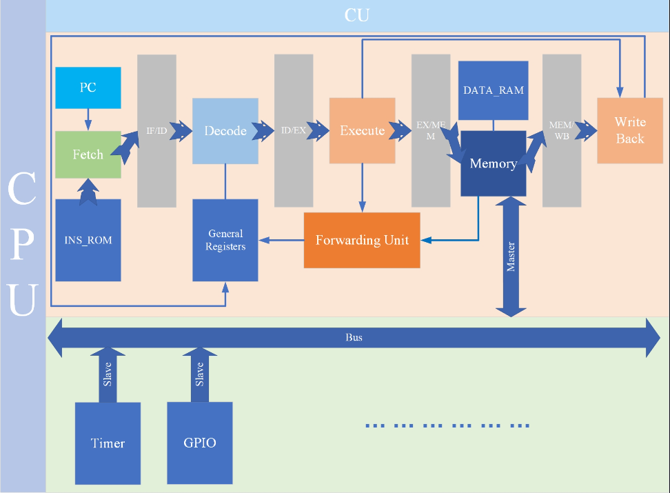

# LITSoC
## 1. 简介
基于RISC-V的一个简单的五级流水线CPU设计
## 2. 开发环境
操作系统: windows10/Ubuntu 20.04

编程语言: 
1. Verilog
2. C/C++
3. python
## 3. 开发工具
1. vscode
    - Verilog-HDL
    - Verilog Format
    - ctags
2. iverilog、Verilator
3. gtkwave
4. Makefile
5. riscv交叉编译工具链
## 4. 文件说明
1. 使用iverilog仿真:
    - 执行run.bat进行全局仿真
    - 执行test.bat进行各个模块的单独仿真(调试用)
2. 使用verilator:
    - 执行Makefile文件进行Verilog的仿真

## 5. 说明

### 5.1 结构

| item    | content|
|:---------: | :--------:|
|指令集架构 | RISC-V|
|CPU结构 | 哈佛结构|
|流水线 | 5级|

### 5.2 外设

| peripheral | address|
|:---------: | :--------:|
|Timer | 0x0000_0000~0x1FFF_FFFF|
|GPIO | 0x2000_0000~0x3FFF_FFFF|
|...| ...|
|暂未添加|暂未添加|

## 6. 数据通路

